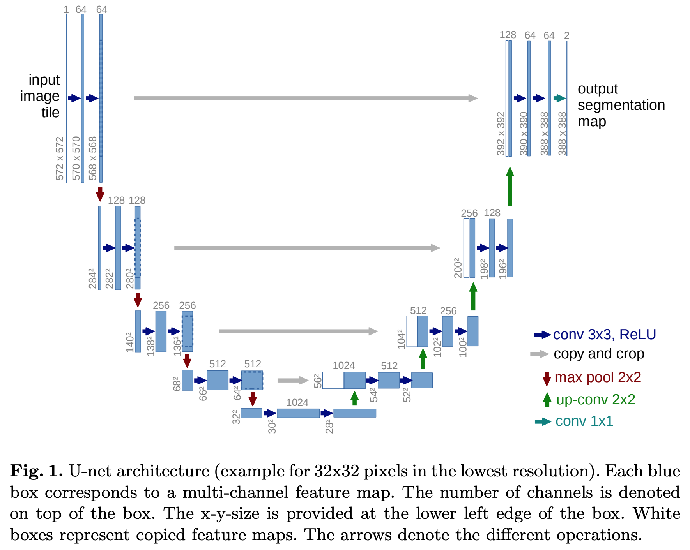
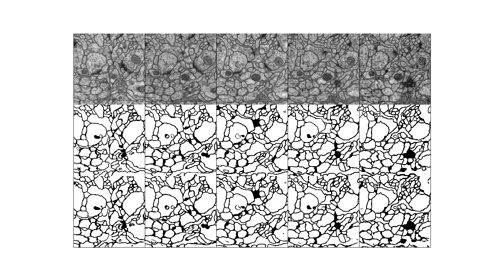

# U-Net

#### Title
[U-Net: Convolutional Networks for Biomedical Image Segmentation](https://arxiv.org/abs/1505.04597)

#### Abstract
There is large consent that successful training of deep networks requires many thousand annotated training samples. In this paper, we present a network and training strategy that relies on the strong use of data augmentation to use the available annotated samples more efficiently. The architecture consists of a contracting path to capture context and a symmetric expanding path that enables precise localization. We show that such a network can be trained end-to-end from very few images and outperforms the prior best method (a sliding-window convolutional network) on the ISBI challenge for segmentation of neuronal structures in electron microscopic stacks. Using the same network trained on transmitted light microscopy images (phase contrast and DIC) we won the ISBI cell tracking challenge 2015 in these categories by a large margin. Moreover, the network is fast. Segmentation of a 512x512 image takes less than a second on a recent GPU. The full implementation (based on Caffe) and the trained networks are available at [this http URL](http://lmb.informatik.uni-freiburg.de/people/ronneber/u-net).

## Data Generation
* Before running Train phase, execute **run_make_database.py** to generate dataset. 

## Train
    $ python main.py --mode train \
                     --scope [scope name] \
                     --name_data [data name] \
                     --dir_data [data directory] \
                     --dir_log [log directory] \
                     --dir_checkpoint [checkpoint directory]
                     --gpu_ids [gpu id; '-1': no gpu, '0, 1, ..., N-1': gpus]
---
    $ python main.py --mode train \
                     --scope unet \
                     --name_data em \
                     --dir_data ./datasets \
                     --dir_log ./log \
                     --dir_checkpoint ./checkpoint
                     --gpu_ids 0

* Set **[scope name]** uniquely.
* To understand hierarchy of directories based on their arguments, see **directories structure** below. 
* Hyperparameters were written to **arg.txt** under the **[log directory]**.

## Test
    $ python main.py --mode test \
                     --scope [scope name] \
                     --name_data [data name] \
                     --dir_data [data directory] \
                     --dir_log [log directory] \
                     --dir_checkpoint [checkpoint directory] \
                     --dir_result [result directory]
                     --gpu_ids [gpu id; '-1': no gpu, '0, 1, ..., N-1': gpus]
---
    $ python main.py --mode test \
                     --scope unet \
                     --name_data em \
                     --dir_data ./datasets \
                     --dir_log ./log \
                     --dir_checkpoint ./checkpoints \
                     --dir_result ./results
                     --gpu_ids 0

* To test using trained network, set **[scope name]** defined in the **train** phase.
* Generated images are saved in the **images** subfolder along with **[result directory]** folder.
* **index.html** is also generated to display the generated images.  

## Tensorboard
    $ tensorboard --logdir [log directory]/[scope name]/[data name] \
                  --port [(optional) 4 digit port number]
---
    $ tensorboard --logdir ./log/unet/em \
                  --port 6006
                  
After the above comment executes, go **http://localhost:6006**

* You can change **[(optional) 4 digit port number]**.
* Default 4 digit port number is **6006**.

## Results

    1st row: input; serial section Transmission Electron Microscopy (ssTEM) 
    2nd row: label; sementation map
    3rd row: output; predection map by unet

* The results were generated by a network trained with **em** dataset during **300 epochs**.
* After running the Test phase, execute **display_result.py** to display the figure.

## Directories structure
    pytorch-UNET
    +---[dir_checkpoint]
    |   \---[scope]
    |       \---[name_data]
    |           +---model_epoch00000.pth
    |           |   ...
    |           \---model_epoch12345.pth
    +---[dir_data]
    |   \---[name_data]
    |       +---test
    |       |   +---00000.npy
    |       |   |   ...
    |       |   \---12345.npy
    |       +---train
    |       |   +---00000.npy
    |       |   |   ...
    |       |   \---12345.npy
    |       \---val
    |           +---00000.npy
    |           |   ...
    |           \---12345.npy
    +---[dir_log]
    |   \---[scope]
    |       \---[name_data]
    |           +---arg.txt
    |           \---events.out.tfevents
    \---[dir_result]
        \---[scope]
            \---[name_data]
                +---images
                |   +---00000-input.png
                |   +---00000-label.png
                |   +---00000-output.png
                |   |   ...
                |   +---12345-input.png
                |   +---12345-label.png
                |   +---12345-output.png
                \---index.html

---

    pytorch-UNET
    +---checkpoints
    |   \---unet
    |       \---em
    |           +---model_epoch0000.pth
    |           |   ...
    |           \---model_epoch0300.pth
    +---datasets
    |   \---em
    |       +---test
    |       |   +---0.npy
    |       |   |   ...
    |       |   \---4.npy
    |       +---train
    |       |   +---0.npy
    |       |   |   ...
    |       |   \---29.npy
    |       \---val
    |           +---0.npy
    |           |   ...
    |           \---4.npy
    +---log
    |   \---unet
    |       \---em
    |           +---arg.txt
    |           \---events.out.tfevents
    \---results
        \---unet
            \---em
                +---images
                |   +---0000-input.png
                |   +---0000-label.png
                |   +---0000-output.png
                |   |   ...
                |   +---0004-input.png
                |   +---0004-label.png
                |   +---0004-output.png
                \---index.html
 
* Above directory is created by setting arguments when **main.py** is executed.               
